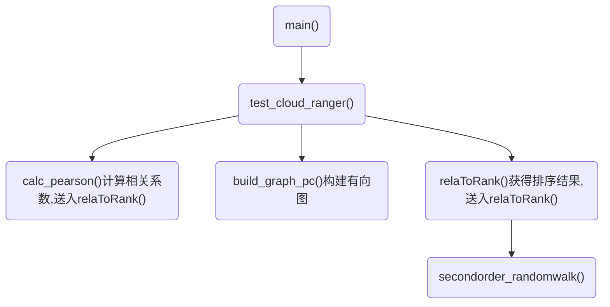

# CloudRanger代码
> Author: potassiummmm

## 调用树



## 函数解释

```Python
def secondorder_randomwalk(
    M, epochs, start_node, label=[], walk_step=1000, print_trace=False
):
	for epoch in range(epochs):
		previous = start_node - 1
        current = start_node - 1
		for step in range(walk_step):
			if np.sum(M[previous, current]) == 0: # 无路可走
                break
            next_node = np.random.choice(range(n), p=M[previous, current])
			score[next_node] += 1
            previous = current
            current = next_node

# Returns: label-score对的列表,根据score排序
```

```Python
# 
def relaToRank(rela, access, rankPaces, frontend, beta=0.1, rho=0.3, print_trace=False):
# Params:
	# rela: 相关系数
	# access: 依赖图
	# rankPaces: 迭代次数

	S = rela[frontend - 1] # 与前端服务的相关性列表
	P = [[0 for col in range(n)] for row in range(n)] # 点转移概率矩阵
	# 边转移概率矩阵
	# M[k,i,j]: k->i->j的概率
	M = np.zeros([n, n, n])
	...
	# 遍历出边、入边、自环,分别计算向前转移、向后转移、原地不动的概率
	...
	l = secondorder_randomwalk(M, rankPaces, frontend, label, print_trace=print_trace)

# Returns: l, P, M

```

```Python
def test_cloud_ranger(
    data_source="real_micro_service",
    pc_aggregate=5,
    pc_alpha=0.1,
    testrun_round=1,
    frontend=18,
    true_root_cause=[6, 13, 28, 30, 31],
    beta=0.3,
    rho=0.2,
):
# Params:
	# pc_aggregate: 聚合系数
	# pc_alpha: PC算法系数alpha

	rela = calc_pearson(data, method="numpy", zero_diag=False) # 计算Pearson相关系数
	dep_graph = build_graph_pc(data, alpha=pc_alpha) # 使用PC算法构建依赖图
	rank, P, M = relaToRank(
            rela, access, 10, frontend, beta=beta, rho=rho, print_trace=False
    )

```

```Python
def build_graph_pc(data, alpha):
	ic_algorithm = IC(RobustRegressionTest, alpha=alpha) # IC*算法
    graph = ic_algorithm.search(X, variable_types) # 应用Rule1-3构建有向图
```
